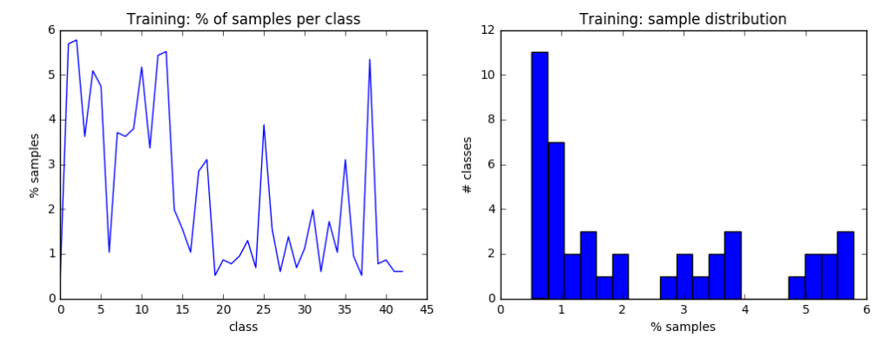
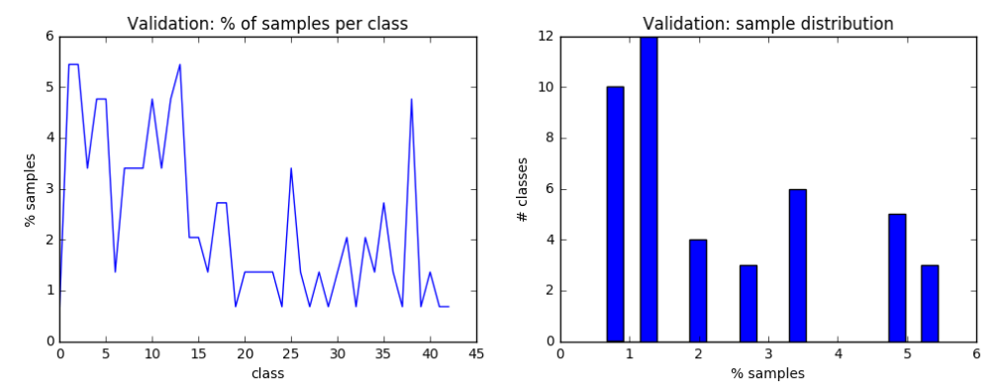

# carnd_traffic_sign_classifier
This is a German traffic signs classifier written in TensorFlow, which I created as part of Udacity's Self-Driving Car Engineer Nanodegree (carnd).

##The goals / steps of this project are the following:

* Load the data set 
* Explore, summarize and visualize the data set
* Design, train and test a model architecture
* Use the model to make predictions on new images
* Analyze the softmax probabilities of the new images

### Loading the dataset
First thing's first: download the [dataset](https://d17h27t6h515a5.cloudfront.net/topher/2017/February/5898cd6f_traffic-signs-data/traffic-signs-data.zip)
```
$ wget https://d17h27t6h515a5.cloudfront.net/topher/2017/February/5898cd6f_traffic-signs-data/traffic-signs-data.zip
```
The zip file contains 3 pickle files with training, validation and test images, all resized to 32x32 pixels.<br>
The zip file also contains a CSV file (signnames.csv) with the first column containing the class ID (an integer spanning 0-42), and the second column containing a descriptive name of the sign<br>
Here are the first 4 rows:

| ClassId| SignName    |
| :-----:|-------------|
| 0      | Speed limit (20km/h) |
| 1      | Speed limit (30km/h) |
| 2      | Speed limit (50km/h) |
| 3      | Speed limit (60km/h) |

A quick examination of the data sets yields these stats:
```
Number of training examples = 34799
Number of validation examples = 4410
Number of testing examples = 12630
Image data shape = (32, 32, 3)
Number of classes = 43
```

### Explore, summarize and visualize the data set
Distribution of the training samples:

It is evident that the classes do not have equal distribution within the training dataset.  Because there are 43 classes, had the samples been distributed equally, we would have 2.33% (100/43) of the samples in each class.  However, in the actual dataset distribution, most classes comprise less than 2%.  Class 2 has the largest number of samples (5.78%), and classes 0 and 19 have the lowest representation (0.52%).<br>
The validation dataset also doesn't distribute the samples between the classes in an equal manner:

It is also interesting to look at how well the validation dataset represents the training set.  In the following table and graph, a ratio close to 1 indicates that there about the same fraction of validation samples as training samples, in the specific class.
A high ratio means that the class has a larger represnetation in the validation dataset.<br>
Class 21 has a ratio of 1.75, which means that its size in the validation is almost twice its size in the training set.  Incidentaly, class 21 also has a low representation in the training dataset.  These two factors together, would make it likely that class 21 will have many errors in the validation testing.

<br>
Next, let's have a quick look at an image from each class, just to start getting familiar with the images themselves.

<br>
We see here several very dark images, some blurry images.  Images are mostly centered, and mostly occupy the same amount of area within each image.  Images are mostly upright, but there are a few with a bit of rotation.  Backgrounds vary, but are mostly yellowish-brownish.<br>
<br>
Now I want to dig deeper into one of the classes.  Class 0 is small and might need augmenting, so let's look at it.

<br>
Wow!
Next we look at class 0 images from the validation dataset.  

<br>
Another wow!  These images look almost all the same - it's as if they were taken from the window of a slow moving car.<br>
I don't have much experience, but this kind of repetitivity seems problematic since its mostly testing for a small number of features, because these images are highly corrolated.
<br>
I also examined class 19, since it is also very small (180 training samples).  It exhibited similar chracteristics, but the training set has almost 30 very dark images (~15% of the images).  

<br>
Even when I look at these closer (larger) they look extremely dark.

<br>
I converted them to grayscale, and look at the improvement!  Now grayscale is defintiley going to be part of the preprocessing I will do.
<br>

<br>
