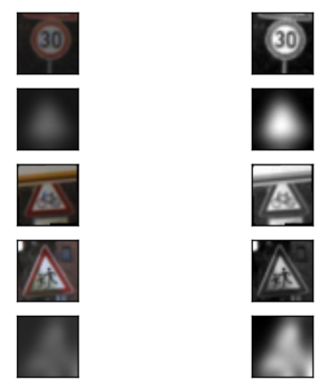

# carnd_traffic_sign_classifier
This is a German traffic signs classifier written in TensorFlow, which I created as part of Udacity's Self-Driving Car Engineer Nanodegree (carnd).

##The phases of this project are the following:

* Loading the dataset
* Dataset summary, exploration and visualization
* Design, train and test a model architecture
* Use the model to make predictions on new images
* Analyze the softmax probabilities of the new images

### Loading the dataset
First thing's first: download the [dataset](https://d17h27t6h515a5.cloudfront.net/topher/2017/February/5898cd6f_traffic-signs-data/traffic-signs-data.zip)
```
$ wget https://d17h27t6h515a5.cloudfront.net/topher/2017/February/5898cd6f_traffic-signs-data/traffic-signs-data.zip
```
The zip file contains 3 pickle files with training, validation and test images, all resized to 32x32 pixels.<br>
The zip file also contains a CSV file (signnames.csv) with the first column containing the class ID (an integer spanning 0-42), and the second column containing a descriptive name of the sign<br>
Here are the first 4 rows:

| ClassId| SignName    |
| :-----:|-------------|
| 0      | Speed limit (20km/h) |
| 1      | Speed limit (30km/h) |
| 2      | Speed limit (50km/h) |
| 3      | Speed limit (60km/h) |

A quick examination of the data sets yields these stats:
```
Number of training examples = 34799
Number of validation examples = 4410
Number of testing examples = 12630
Image data shape = (32, 32, 3)
Number of classes = 43
```
Each class represents a differnet traffic sign.<br>
I think it is odd that the test set is larger than the validation set and that it is <i>so</i> large: it is 1/3 the size of the training set and 3 times the size of the validation set.  The validation set is in fact only about 12.7% of the training set, while 20% is recommended.  When I used part of the training set for validation (instead of using the supplied validation set), I received very good validation results.  However, I chose to use the suuplied validation set, as it seemed more appropriate.
```
X_train, X_valid, y_train, y_valid = train_test_split(train['features'], train['labels'], test_size=0.2, random_state=0)
```
### Dataset summary, exploration and visualization
I plotted the distribution of the training samples between the classes

It is evident that the classes do not have equal representation in the training dataset.  Because there are 43 classes, had the samples been distributed equally, we would have 2.33% (100%/43) of the samples in each class.  However, in the actual dataset distribution, most classes comprise less than 2%.  In fact, although the mean representation is 2.33%, the median is 1.55%, which means that half the classes have a representation below 1.55%<br>
Class 2 has the largest number of samples (5.78%), and classes 0 and 19 have the lowest representation (0.52% each).  I also plotted a histogram of the percent-of-samples per class.  This graph provides another look at how the samples distribute between the classes and it also shows that most classes have a very low representation.<br>
The validation dataset also doesn't distribute the samples between the classes in an equal manner.  
It is interesting to look at how well the validation dataset represents the training set, and that's the reason I plotted the distributions of the training and validation set in the same plot.  Looking at the plot we see q large resemblence in the distributions of the two sets, but I wanted to make sure this is the case.  I divided the percent representation of each class in the training set, by its representation in the validation set and called this the "ratio"  A ratio close to 1 indicates that there about the same fraction of validation samples as training samples, in the specific class.  In the iPython notebook I print the "ratio" value for each class, but here it sufficient to note that the median=1.03  and mean=0.94.  Although the two datasets distribute similarly enough, the plot below shows that there are enough outliers to raise my curiousity if the classes that have low/high ratio will show poor validation accuracy.  We shall see.<br>

<br>
Next, let's have a quick look at an image from each class, just to start getting familiar with the images themselves.<br>

<br>
We see here several very dark images, some blurry images.  Images are mostly centered, and mostly occupy the same amount of area within each image.  Images are mostly upright, but there are a few with a bit of rotation.  Backgrounds vary, but are mostly yellowish-brownish.<br>
<br>
Now I want to dig deeper into one of the classes.  It is important to spend time reviewing the finer details of the images and watch for different qualities and characteristics they may have.  This will help in deciding what augmentations may help during the training of the model.<br>
Class 0 is small and might need augmenting, so let's look at it.

<br>
This is a bit surprising: I expected more variance, but it looks like there's a small set of signs that appear multiple times with some differences.  Not exactly what I was expecting.
Next we look at class 0 images from the validation dataset.  

<br>
Another surprise!  These images look almost all the same - it's as if they were taken from the window of a slow moving car.<br>
I don't have much experience, but this kind of repetitivity seems problematic since its mostly testing for a small number of features, because these images are highly corrolated.  On the other hand, I suppose that in a real driving scenario, this is exaclty what we would expect to see: the same sign with some small variance due to the car movement.
<br>
I also examined class 19, since it is also small enough to display (180 training samples).  It exhibited similar chracteristics, but the training set has almost 30 very dark images (~15% of the images).  

<br>
Even when I look at these closer (larger) they look extremely dark.

<br>
I converted them to grayscale, and look at the improvement!  Grayscale is just a dot product of [R,G,B] and [0.299, 0.587, 0.114], so I imagine this "feature" can be learned by the network.  I.e. the network can learn to exract the luminance feature if it determines it is important enough.  If in the pre-processing phase I will convert the dataset images to grayscale, I will bascially make the decision that the chroma channels are not important and that the luminance data is sufficient to represent the inputs.  These dark images give me confidence that there's a lot of information in the luminance data.
<br>

<br>
###Design, train and test a model architecture
The code for preprocessing the image datasets is in the iPython cell which has "Preprocessing utilities" as the first remark.<br>
I first convert the RGB images to grayscale.  There's little color information in the images, and I think that the structure of the signs is enough. Yann LeCun reported in his paper that this helped increase the predcition accuracy by a small bit, while decreasing the complexity of the model (we only have to deal with one third of the input features).<br>
Next, I perform [min-max scaling](http://sebastianraschka.com/Articles/2014_about_feature_scaling.html#about-min-max-scaling) (also known as scale normalization) to rescale the pixels to the 0-1 floating-point range.  It is common practice to do this in cases where the input features have different scales, but in 8-bit integer grayscale images the pixels are already within the same value range (0-255), so it would seem unnecessary to do this rescaling.  Finally, I standardized the data using [Z-score normalization](http://lamda.nju.edu.cn/weixs/project/CNNTricks/CNNTricks.html) which centers (mean=0) and normalizes (std=1) all of the images.<br>
As a sanity check, I display the same 4 dark left-turn signs from the pre-processed image set and display them:<br>

<br>
Before applying the image preprocessing, I need to augment the dataset.  I'm augmenting because I want to make the classes have a bit better representation distribution.  I'm augmenting a class by taking each image from that class in the dataset and add augmented copies of it.
The augmentation is performed with scipy's ndimage library.  I only augment the classes that have "low" representation (1% or lower).  For classes with representation below 0.7% I apply extra augmentation (three times as much augmented images).  I could have chosen a more elaborate augmentation policy, and there's more experimenting that I can do, but will skip due to lack of time.  After the augmentation the distribution is much better:<br><br>

I tried two different augmentations: random rotation of angles chosen in the range {-15, 15}, and random bluring levels.  I choose between the two randomly.
Finally, I apply the pre-processing on the newly augmented training dataset, and then plot 5 random images, for some sanity checks:<br>

<br><br>
I tried four different network models which I named netanet1 thru netanet4.  All are very similar and are some variant of the LeNet architecture:<br>

<br>
After trials and tribulations I settled on netanet4.  As I describe below, I ran training & validation runs and plotted the results against one another, but I don't show all of these runs.  Instead, the data below refers to netanet4 only.  I use three convolution layers which I made quite deep - all in an attempt to extract more features.  The last convolution layer uses a smaller 3x3 kernel as the IFMs were getting pretty small due to the two max-pool layers.  I only used 2 FC layers hoping that this would be enough to capture the interaction between the feature-maps.  A 50% dropout layer should prevent overfitting.
<br>
Hyper-parameters which I considered included the learning-rate, the batch size, the number of epochs, and the network topology itself. Along the way I changed other "hyper-parameters" such as the types of the augmentations I need to apply, the classes I applied the augmentations, and the types of pre-processing.  That's quite a lot of tuning and I feel that I've got a long way to go before I understand the interactions between these hyper-parameters.  One of the first things I tried, was adding the pre-processing step which added approximately 2% of accuracy improvement.  Adding normalization to the preprocessing did wonders to the Loss behavior.  Instead of the Loss jerking around, it became much smoother.  The graphs below shows this:<br>
Loss before normalization:
<br>

<br>
Loss after normalization:
<br>

<br>
I also slowly increased the number of epochs, since I understood that I needed to give the training process enough time to reach the minimum, or get out of a local minimum and continue searching for the global loss minimum.
<br>
Eventually, I had to finish this task and settle on some values for these hyper-parameters.  However, it became obvious along the way, that I need create some kind of light framework to capture the training process and results.  At minimum, I needed to collect and archive the results of each run, so that I'll be able to load them to a single graph and do some comparisons.<br>
I wrote three classes to aid in the training.  One class encapsulates the training configuration (TrainingConfig), another collects results (TrainingResults), and one performs the actual training (CnnTrainer).  I supplement this with some code to archive all of the training artificats.  I do this so that I can graph all of the results and compare them to one another.  I placed this code in a separate IPython notebook because things were getting messy for me (results_comparison.ipynb).<br>
#### Comparing the models
So what am I comparing?  Obviously, the goal is to maximize the validation accuracy.  
I also graphed the errors distribution between the classes, and something I call (maybe I heard it somewhere) the class confusion graph.  The confusion graph of a class, show what classes are predicted for a specific class.<br>
[Anrdej Karpathy's Stanford CS231n notes](http://cs231n.github.io/neural-networks-3/#loss) provide some information on how to interpret the loss function behavior.  The shape of the Loss graph gives clues into tuning the learning rate and batch size (the batch size might be a little too low if the loss is too noisy).  Following Karpathy's advice I plot the Loss on both a linear and log scale and I found them both interesting.  The linear scale makes the "hockey stick" shape more pronounced which help determine if this shape is "healthy" (not too steep and not too gradual); while the log scale "magnifies" the details of the Loss function behavior as the Loss decreases, making comparisons between inference runs easier.<br>
I wanted to use a decaying learning rate because it looked like after a certain amount of epochs, the Loss kind of bounces around in some small range.  I thought this might be due to the size of the learning rate.  From the TensorFlow documentation it appeared that  tf.contrib.layers.xavier_initializer is a good candidate for the decay function, but from reading around I understood that [tf.train.AdamOptimizer](https://www.tensorflow.org/api_docs/python/tf/train/AdamOptimizer) already takes care of learning rate decay.  According to Karpathy: "In practice Adam is currently recommended as the default algorithm to use" so I didn't want to change that.  I wanted to try out different values for 'epsilon' as recommended ("The default value of 1e-8 for epsilon might not be a good default in general"), but I didn't have enough time to do that.

<br>
Karpathy also provides insights into interpreting the validation vs. training accuracy graph, which is used to look for overfitting.<br>
The graphs below display some of the statistics I collected, while training the networks and comparing them. <br> 
# INSERT 
# SUMMARY VALIDATION GRAPHS HERE
<br>
This graph shows the error distribution of one of the runs.  It shows for example, that class 24 has the highest error rate.  <br>

<br>
Let's take a look at class 24's confusion graph and see what class is giving it problems:<br>

### Use the model to make predictions on new images
I collected 6 German traffic signs by cropping an [image](http://electronicimaging.spiedigitallibrary.org/data/journals/electim/927109/jei_22_4_041105_f010.png) I found on the Web and ran predictions and top-5 softmax results for them.<br>

| Image         | Prediction    | Top5  |
| ------------- |:-------------:| -----:|
|       | Correct | $1600 |
|       | Correct      |   $12 |
|  | Correct      |    $1 |
|       | Correct | $1600 |
|       | Correct      |   $12 |
|  | Correct     |    $1 |

<br>
I also used the test dataset I described at the top to make predictions.  Here's how it looks.<br>

### INSERT GRAPH HERE
